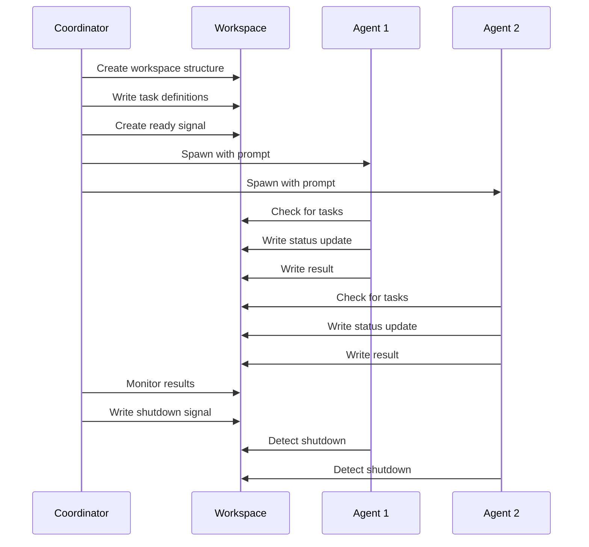

# OpenCode Swarm Orchestration
Author: Gregory Starr
Inspired by the gist by: kiernan klaassen https://gist.github.com/kieranklaassen/4f2aba89594a4aea4ad64d753984b2ea, and the work of the caude code team. thanks
Master multi-agent orchestration using OpenCode's agent spawning and coordination patterns.

|name                         |description                                                                                                                                                                                              |
|-----------------------------|---------------------------------------------------------------------------------------------------------------------------------------------------------------------------------------------------------|
|orchestrating-opencode-swarms|Master multi-agent orchestration in OpenCode. Use when coordinating multiple agents, running parallel code reviews, creating pipeline workflows, or any task benefiting from divide-and-conquer patterns.|

-----

## Core Differences from Claude Code

OpenCode uses a **simpler, file-based coordination model** instead of Claude Code's TeammateTool:

|Aspect             |Claude Code                   |OpenCode                        |
|-------------------|------------------------------|--------------------------------|
|**Team Management**|TeammateTool with team configs|Shared workspace directory      |
|**Communication**  |JSON inbox files              |Markdown files or shared state  |
|**Task System**    |Built-in Task primitives      |Custom task files or simple JSON|
|**Agent Spawning** |Task tool with team_name      |Direct agent invocation         |
|**Coordination**   |Leader/teammate inbox messages|File-based signals              |

-----

## Table of Contents

1. [Core Architecture](#core-architecture)
1. [Agent Spawning in OpenCode](#agent-spawning-in-opencode)
1. [File-Based Coordination](#file-based-coordination)
1. [Communication Patterns](#communication-patterns)
1. [Task Management](#task-management)
1. [Orchestration Patterns](#orchestration-patterns)
1. [Complete Workflows](#complete-workflows)
1. [Best Practices](#best-practices)

-----

## Core Architecture

### How OpenCode Swarms Work

An OpenCode swarm consists of:

- **Coordinator** (you) - Creates work directory, spawns workers, aggregates results
- **Workers** (spawned agents) - Execute tasks independently
- **Shared Workspace** - Directory with task definitions and results
- **Signal Files** - Simple files that agents use to communicate state

### File Structure

```
/tmp/swarm-workspace/
├── tasks/
│   ├── task-1.json          # Task definition
│   ├── task-1-result.md     # Task result
│   ├── task-2.json
│   └── task-2-result.md
├── agents/
│   ├── agent-1-status.json  # Agent heartbeat/status
│   └── agent-2-status.json
└── coordination/
    ├── ready.txt            # Signals that setup is complete
    └── shutdown.txt         # Signals workers should exit
```

### Coordination Flow



-----

## Agent Spawning in OpenCode

### Method 1: Background Process

Spawn agents as background bash processes:

```bash
# In coordinator agent
bash_tool({
  command: `
    # Create workspace
    mkdir -p /tmp/swarm-workspace/{tasks,agents,results}
    
    # Write task definition
    cat > /tmp/swarm-workspace/tasks/analyze-auth.json << 'EOF'
    {
      "id": "analyze-auth",
      "type": "code-analysis",
      "description": "Analyze authentication code for security issues",
      "files": ["app/models/user.rb", "app/controllers/sessions_controller.rb"],
      "status": "pending"
    }
    EOF
    
    # Spawn worker in background
    nohup opencode -p "
    You are a security analysis agent.
    
    1. Read task from /tmp/swarm-workspace/tasks/analyze-auth.json
    2. Perform security analysis on the specified files
    3. Write results to /tmp/swarm-workspace/results/analyze-auth.md
    4. Update status to 'completed' in task file
    
    When done, create /tmp/swarm-workspace/agents/\$(uuidgen)-done.txt
    " > /tmp/swarm-workspace/agents/worker-1.log 2>&1 &
    
    echo $! > /tmp/swarm-workspace/agents/worker-1.pid
  `,
  description: "Spawn security analysis worker"
})
```

### Method 2: Tmux Panes (Visible)

For debugging or when you want to see agent output:

```bash
bash_tool({
  command: `
    # Create tmux session with multiple panes
    tmux new-session -d -s swarm 'opencode -p "Coordinator: monitor /tmp/swarm-workspace"'
    
    # Split and spawn worker 1
    tmux split-window -h -t swarm 'opencode -p "Worker 1: Process tasks in /tmp/swarm-workspace/tasks"'
    
    # Split and spawn worker 2
    tmux split-window -v -t swarm 'opencode -p "Worker 2: Process tasks in /tmp/swarm-workspace/tasks"'
    
    # Attach to see all agents working
    tmux attach -t swarm
  `,
  description: "Create visible swarm in tmux"
})
```

### Method 3: Sequential Sub-Agents

For simpler cases, just invoke sub-agents sequentially:

```bash
# Process each task with a dedicated agent
for task in security performance architecture; do
  opencode -p "Review code for ${task}. Output to /tmp/results/${task}.md"
done
```

-----

## File-Based Coordination

### Task Definitions

Simple JSON files define work:

```json
{
  "id": "review-auth",
  "type": "security-review",
  "description": "Review authentication module for vulnerabilities",
  "priority": "high",
  "files": [
    "app/models/user.rb",
    "app/controllers/sessions_controller.rb"
  ],
  "status": "pending",
  "assigned_to": null,
  "created_at": "2026-01-26T00:00:00Z"
}
```

### Status Files

Agents write status updates:

```json
{
  "agent_id": "worker-1",
  "current_task": "review-auth",
  "status": "in_progress",
  "last_heartbeat": "2026-01-26T00:01:00Z",
  "progress": "Analyzed 2 of 3 files"
}
```

### Result Files

Markdown files for human-readable results:

```markdown
# Security Review: Authentication Module

**Reviewer:** worker-1  
**Date:** 2026-01-26  
**Status:** ✅ Complete

## Findings

### Critical Issues
- SQL injection vulnerability in User.authenticate (line 45)
- Session token stored in plain text (sessions_controller.rb:23)

### Recommendations
1. Use parameterized queries for authentication
2. Encrypt session tokens at rest
3. Add rate limiting to login endpoint
```

### Signal Files

Simple presence-based signals:

```bash
# Ready signal - workers start when this exists
touch /tmp/swarm-workspace/coordination/ready.txt

# Shutdown signal - workers exit when this exists
touch /tmp/swarm-workspace/coordination/shutdown.txt

# Task claim - worker creates file to claim task
touch /tmp/swarm-workspace/tasks/task-1.claimed-by-worker-2

# Completion signal
touch /tmp/swarm-workspace/tasks/task-1.completed
```

-----

## Communication Patterns

### Pattern 1: Polling

Workers periodically check for work:

```bash
# Worker loop
while true; do
  # Check for shutdown
  if [ -f /tmp/swarm-workspace/coordination/shutdown.txt ]; then
    echo "Shutdown detected, exiting"
    break
  fi
  
  # Find available task
  task=$(ls /tmp/swarm-workspace/tasks/*.json 2>/dev/null | \
         grep -v '.claimed' | \
         head -n 1)
  
  if [ -n "$task" ]; then
    # Claim task
    touch "${task}.claimed-by-$(hostname)-$$"
    
    # Process task
    opencode -p "Process task: $(cat $task)"
    
    # Mark complete
    touch "${task}.completed"
  fi
  
  sleep 5
done
```

### Pattern 2: Message Queue

Use a simple append-only log:

```bash
# Coordinator sends message
echo "$(date -Iseconds)|coordinator|worker-1|PRIORITY_CHANGE|task-auth|high" >> \
  /tmp/swarm-workspace/coordination/messages.log

# Worker reads new messages
tail -f /tmp/swarm-workspace/coordination/messages.log | while read msg; do
  IFS='|' read -r timestamp from to type data <<< "$msg"
  
  if [ "$to" = "$(hostname)-$$" ] || [ "$to" = "all" ]; then
    # Handle message
    case $type in
      PRIORITY_CHANGE) echo "Priority updated: $data" ;;
      SHUTDOWN) exit 0 ;;
    esac
  fi
done
```

### Pattern 3: Shared State File

Single JSON file with atomic updates:

```bash
# Update shared state atomically
update_state() {
  local temp=$(mktemp)
  
  # Read-modify-write with file lock
  (
    flock -x 200
    jq ".workers[\"worker-1\"].status = \"idle\"" \
      /tmp/swarm-workspace/state.json > "$temp"
    mv "$temp" /tmp/swarm-workspace/state.json
  ) 200>/tmp/swarm-workspace/state.lock
}
```

-----

## Task Management

### Task Lifecycle

```
pending → claimed → in_progress → completed
                 ↘ failed
```

### Creating Tasks

```bash
# Coordinator creates task pool
create_task() {
  local id=$1
  local description=$2
  local files=$3
  
  cat > "/tmp/swarm-workspace/tasks/${id}.json" << EOF
{
  "id": "${id}",
  "description": "${description}",
  "files": ${files},
  "status": "pending",
  "created_at": "$(date -Iseconds)"
}
EOF
}

# Create multiple tasks
create_task "review-user-model" "Security review" '["app/models/user.rb"]'
create_task "review-auth-controller" "Security review" '["app/controllers/auth_controller.rb"]'
create_task "review-payment" "Security review" '["app/services/payment.rb"]'
```

### Claiming Tasks

Workers atomically claim tasks:

```bash
claim_task() {
  local task_file=$1
  local worker_id=$2
  local claimed_file="${task_file}.claimed"
  
  # Atomic claim using ln (fails if already exists)
  if ln -s "$worker_id" "$claimed_file" 2>/dev/null; then
    # Successfully claimed
    jq ".status = \"claimed\" | .assigned_to = \"$worker_id\"" \
      "$task_file" > "${task_file}.tmp"
    mv "${task_file}.tmp" "$task_file"
    return 0
  else
    # Already claimed by another worker
    return 1
  fi
}
```

### Completing Tasks

```bash
complete_task() {
  local task_file=$1
  local result_file=$2
  
  # Update task status
  jq ".status = \"completed\" | .completed_at = \"$(date -Iseconds)\"" \
    "$task_file" > "${task_file}.tmp"
  mv "${task_file}.tmp" "$task_file"
  
  # Create completion signal
  touch "${task_file}.completed"
}
```

-----

## Orchestration Patterns

### Pattern 1: Parallel Workers

Multiple workers process independent tasks:

```bash
#!/bin/bash
# coordinator.sh

WORKSPACE=/tmp/swarm-workspace

# Setup
mkdir -p $WORKSPACE/{tasks,results,agents}

# Create task pool
for file in app/models/*.rb; do
  task_id=$(basename "$file" .rb)
  cat > "$WORKSPACE/tasks/${task_id}.json" << EOF
{
  "id": "${task_id}",
  "file": "${file}",
  "type": "security-review"
}
EOF
done

# Spawn 3 workers
for i in 1 2 3; do
  nohup opencode -p "
    Worker ${i}: Process security reviews.
    
    Loop:
    1. Find unclaimed task in $WORKSPACE/tasks/
    2. Claim it (create .claimed file)
    3. Read file and perform security review
    4. Write results to $WORKSPACE/results/TASKID.md
    5. Mark task completed
    6. Repeat until no tasks remain
    
    Exit when no tasks found after 3 checks (30 sec apart)
  " > "$WORKSPACE/agents/worker-${i}.log" 2>&1 &
  
  echo $! > "$WORKSPACE/agents/worker-${i}.pid"
done

# Monitor completion
while true; do
  pending=$(ls $WORKSPACE/tasks/*.json 2>/dev/null | \
            grep -v '.claimed' | \
            wc -l)
  
  if [ $pending -eq 0 ]; then
    echo "All tasks complete"
    break
  fi
  
  sleep 5
done

# Aggregate results
cat $WORKSPACE/results/*.md > final-report.md
```

### Pattern 2: Pipeline

Sequential stages with dependencies:

```bash
#!/bin/bash
# pipeline.sh

WORKSPACE=/tmp/pipeline-workspace
mkdir -p $WORKSPACE/{stages,results}

# Stage 1: Research
cat > $WORKSPACE/stages/1-research.json << 'EOF'
{
  "stage": 1,
  "name": "research",
  "description": "Research OAuth best practices",
  "depends_on": [],
  "status": "pending"
}
EOF

# Stage 2: Design (depends on research)
cat > $WORKSPACE/stages/2-design.json << 'EOF'
{
  "stage": 2,
  "name": "design",
  "description": "Design OAuth implementation",
  "depends_on": [1],
  "status": "pending"
}
EOF

# Stage 3: Implement (depends on design)
cat > $WORKSPACE/stages/3-implement.json << 'EOF'
{
  "stage": 3,
  "name": "implement",
  "description": "Implement OAuth",
  "depends_on": [2],
  "status": "pending"
}
EOF

# Process pipeline
for stage in 1 2 3; do
  stage_file="$WORKSPACE/stages/${stage}-*.json"
  
  # Check dependencies
  deps=$(jq -r '.depends_on[]' $stage_file 2>/dev/null)
  for dep in $deps; do
    dep_status=$(jq -r '.status' "$WORKSPACE/stages/${dep}-*.json")
    if [ "$dep_status" != "completed" ]; then
      echo "Waiting for stage $dep to complete..."
      while [ "$dep_status" != "completed" ]; do
        sleep 5
        dep_status=$(jq -r '.status' "$WORKSPACE/stages/${dep}-*.json")
      done
    fi
  fi
done
  
  # Execute stage
  stage_name=$(jq -r '.name' $stage_file)
  stage_desc=$(jq -r '.description' $stage_file)
  
  opencode -p "
    Stage ${stage}: ${stage_desc}
    
    $([ $stage -gt 1 ] && echo "Previous results: $(cat $WORKSPACE/results/$((stage-1))-*.md)")
    
    Write your results to $WORKSPACE/results/${stage}-${stage_name}.md
  "
  
  # Mark completed
  jq '.status = "completed"' $stage_file > "${stage_file}.tmp"
  mv "${stage_file}.tmp" $stage_file
done
```

### Pattern 3: Map-Reduce

Parallel processing with aggregation:

```bash
#!/bin/bash
# map-reduce.sh

WORKSPACE=/tmp/mapreduce-workspace
mkdir -p $WORKSPACE/{map,reduce}

# Map phase: Split work
files=(app/models/*.rb)
num_workers=3
files_per_worker=$((${#files[@]} / num_workers))

for i in $(seq 0 $((num_workers - 1))); do
  start=$((i * files_per_worker))
  end=$((start + files_per_worker - 1))
  
  # Last worker gets remainder
  [ $i -eq $((num_workers - 1)) ] && end=$((${#files[@]} - 1))
  
  # Create map task
  worker_files=("${files[@]:$start:$((end - start + 1))}")
  
  cat > "$WORKSPACE/map/worker-${i}.json" << EOF
{
  "worker_id": ${i},
  "files": $(printf '%s\n' "${worker_files[@]}" | jq -R . | jq -s .),
  "status": "pending"
}
EOF
  
  # Spawn mapper
  nohup opencode -p "
    Map worker ${i}:
    
    Files to process: ${worker_files[*]}
    
    For each file:
    1. Count lines of code
    2. Count security issues
    3. List dependencies
    
    Write results (one JSON object per file) to $WORKSPACE/map/results-${i}.jsonl
  " > "$WORKSPACE/map/worker-${i}.log" 2>&1 &
done

# Wait for all mappers
while [ $(ls $WORKSPACE/map/results-*.jsonl 2>/dev/null | wc -l) -lt $num_workers ]; do
  sleep 2
done

# Reduce phase: Aggregate
opencode -p "
  Reduce phase:
  
  Read all map results from $WORKSPACE/map/results-*.jsonl
  
  Aggregate:
  - Total lines of code
  - Total security issues by severity
  - Most common dependencies
  - Files with most issues
  
  Write final report to $WORKSPACE/reduce/final-report.md
"
```

-----

## Complete Workflows

### Workflow 1: Multi-Specialist Code Review

```bash
#!/bin/bash
# multi-review.sh

WORKSPACE=/tmp/code-review
mkdir -p $WORKSPACE/{tasks,results,coordination}

# Define review types
declare -A SPECIALISTS=(
  [security]="Focus on: SQL injection, XSS, auth bypass, data exposure"
  [performance]="Focus on: N+1 queries, memory leaks, slow algorithms"
  [architecture]="Focus on: SOLID, design patterns, separation of concerns"
  [simplicity]="Focus on: YAGNI, over-engineering, unnecessary complexity"
)

# Create task for each specialist
for specialist in "${!SPECIALISTS[@]}"; do
  cat > "$WORKSPACE/tasks/${specialist}.json" << EOF
{
  "specialist": "${specialist}",
  "focus": "${SPECIALISTS[$specialist]}",
  "files": "app/controllers/users_controller.rb",
  "status": "pending"
}
EOF
done

# Spawn specialists in parallel
for specialist in "${!SPECIALISTS[@]}"; do
  nohup opencode -p "
    You are a ${specialist} specialist.
    
    Task: ${SPECIALISTS[$specialist]}
    
    1. Read $WORKSPACE/tasks/${specialist}.json for details
    2. Review the specified files with your specialist focus
    3. Write detailed findings to $WORKSPACE/results/${specialist}.md
    4. Include severity levels and recommendations
    5. Create $WORKSPACE/coordination/${specialist}.done when complete
  " > "$WORKSPACE/results/${specialist}.log" 2>&1 &
  
  echo $! > "$WORKSPACE/coordination/${specialist}.pid"
done

# Wait for all specialists
echo "Waiting for specialists to complete..."
for specialist in "${!SPECIALISTS[@]}"; do
  while [ ! -f "$WORKSPACE/coordination/${specialist}.done" ]; do
    sleep 2
  done
  echo "✓ ${specialist} review complete"
done

# Synthesize results
opencode -p "
  You are the review coordinator.
  
  Read all specialist reports from $WORKSPACE/results/*.md
  
  Create a unified review summary:
  1. Critical issues (requiring immediate action)
  2. Important issues (should fix before merge)
  3. Suggestions (nice to have)
  4. Overall assessment (approve/reject/needs work)
  
  Write to $WORKSPACE/final-review.md
"

echo "Review complete: $WORKSPACE/final-review.md"
```

### Workflow 2: Research → Plan → Implement

```bash
#!/bin/bash
# research-plan-implement.sh

WORKSPACE=/tmp/rpi-workspace
mkdir -p $WORKSPACE/{stages,artifacts}

# Stage 1: Research
echo "Stage 1: Research"
opencode -p "
  Research OAuth2 authentication best practices for 2026.
  
  Cover:
  - Security considerations (PKCE, token rotation, etc)
  - Popular providers (Auth0, Clerk, Supabase)
  - Rails integration patterns
  - Session management approaches
  
  Write comprehensive research notes to $WORKSPACE/stages/1-research.md
" && touch "$WORKSPACE/stages/1-done"

# Stage 2: Design plan (dependent on research)
[ -f "$WORKSPACE/stages/1-done" ] || exit 1
echo "Stage 2: Planning"
opencode -p "
  Based on research in $WORKSPACE/stages/1-research.md, create an implementation plan.
  
  Include:
  - Architecture diagram (ASCII or mermaid)
  - Database migrations needed
  - New models/controllers/services
  - Third-party gem requirements
  - Configuration requirements
  - Security considerations
  - Testing strategy
  
  Write plan to $WORKSPACE/stages/2-plan.md
" && touch "$WORKSPACE/stages/2-done"

# Stage 3: Implement (dependent on plan)
[ -f "$WORKSPACE/stages/2-done" ] || exit 1
echo "Stage 3: Implementation"
opencode -p "
  Implement OAuth2 authentication according to $WORKSPACE/stages/2-plan.md
  
  Tasks:
  1. Generate migrations
  2. Create User model extensions
  3. Add OAuthController
  4. Add OAuthService
  5. Write comprehensive tests
  6. Update routes
  7. Add environment configuration
  
  Save all generated files to $WORKSPACE/artifacts/
  Write implementation summary to $WORKSPACE/stages/3-implementation.md
"

echo "Implementation complete. Files in $WORKSPACE/artifacts/"
```

### Workflow 3: Codebase Analysis Swarm

```bash
#!/bin/bash
# codebase-swarm.sh

WORKSPACE=/tmp/codebase-analysis
mkdir -p $WORKSPACE/{tasks,results,agents}

# Discover all Ruby files
find app lib -name "*.rb" > "$WORKSPACE/ruby-files.txt"

# Split files into batches for parallel processing
split -l 10 "$WORKSPACE/ruby-files.txt" "$WORKSPACE/tasks/batch-"

# Count batches
num_batches=$(ls $WORKSPACE/tasks/batch-* | wc -l)
echo "Created $num_batches batches"

# Spawn worker for each batch
for batch in $WORKSPACE/tasks/batch-*; do
  batch_id=$(basename "$batch")
  
  nohup opencode -p "
    Analysis worker for ${batch_id}
    
    Files to analyze: $(cat $batch)
    
    For each file, extract:
    - Lines of code
    - Number of methods/classes
    - Complexity metrics (cyclomatic complexity)
    - Dependencies (require/include statements)
    - TODO/FIXME comments
    - Potential security issues
    
    Write results as JSON to $WORKSPACE/results/${batch_id}.json
    
    Format:
    {
      \"file\": \"path/to/file.rb\",
      \"loc\": 150,
      \"methods\": 12,
      \"classes\": 2,
      \"complexity\": \"high\",
      \"dependencies\": [\"activerecord\", \"redis\"],
      \"todos\": 3,
      \"security_concerns\": [\"SQL string interpolation on line 45\"]
    }
  " > "$WORKSPACE/agents/${batch_id}.log" 2>&1 &
  
  echo $! > "$WORKSPACE/agents/${batch_id}.pid"
done

# Monitor progress
echo "Monitoring worker progress..."
while true; do
  completed=$(ls $WORKSPACE/results/batch-*.json 2>/dev/null | wc -l)
  echo "Progress: ${completed}/${num_batches} batches"
  
  [ $completed -eq $num_batches ] && break
  sleep 5
done

# Aggregate results
echo "Aggregating results..."
opencode -p "
  Aggregate all analysis results from $WORKSPACE/results/batch-*.json
  
  Create comprehensive report with:
  
  1. Overall Statistics
     - Total LOC
     - Total files analyzed
     - Average complexity
     
  2. Top 10 Files by:
     - Lines of code
     - Complexity
     - Number of dependencies
     - Security concerns
     
  3. Dependency Graph
     - Most used dependencies
     - Unused dependencies
     
  4. Technical Debt
     - Total TODO/FIXME comments
     - High complexity files
     - Files needing refactoring
     
  5. Security Summary
     - Total security concerns
     - Critical issues requiring immediate attention
  
  Write to $WORKSPACE/final-report.md
"

echo "Analysis complete: $WORKSPACE/final-report.md"
```

-----

## Best Practices

### 1. Use Atomic File Operations

Prevent race conditions:

```bash
# Good: Atomic rename
echo "data" > file.tmp && mv file.tmp file.json

# Good: Atomic link for claiming
ln -s worker-1 task.claimed || echo "Already claimed"

# Bad: Non-atomic check-then-set
if [ ! -f task.claimed ]; then
  touch task.claimed  # Race condition!
fi
```

### 2. Implement Heartbeats

Detect crashed workers:

```bash
# Worker heartbeat loop
while true; do
  echo "$(date -Iseconds)" > "$WORKSPACE/agents/worker-1-heartbeat.txt"
  sleep 10
done &

# Coordinator checks heartbeats
check_heartbeats() {
  for heartbeat in $WORKSPACE/agents/*-heartbeat.txt; do
    last_beat=$(cat "$heartbeat")
    age=$(($(date +%s) - $(date -d "$last_beat" +%s)))
    
    if [ $age -gt 60 ]; then
      worker=$(basename "$heartbeat" -heartbeat.txt)
      echo "WARNING: $worker appears dead (last beat ${age}s ago)"
    fi
  done
}
```

### 3. Use Descriptive Task IDs

```bash
# Good
task_id="review-user-model-security"
task_id="implement-oauth-google-provider"

# Bad
task_id="task-1"
task_id="a73b9d2f"
```

### 4. Log Everything

```bash
# Create structured logs
log() {
  local level=$1
  shift
  echo "[$(date -Iseconds)] [$level] $*" >> "$WORKSPACE/agents/worker-1.log"
}

log INFO "Starting task: review-user-model"
log ERROR "Failed to parse JSON: syntax error"
log SUCCESS "Task completed in 45s"
```

### 5. Graceful Shutdown

```bash
# Coordinator signals shutdown
touch "$WORKSPACE/coordination/shutdown.txt"

# Workers check periodically
while true; do
  if [ -f "$WORKSPACE/coordination/shutdown.txt" ]; then
    log INFO "Shutdown signal received, cleaning up..."
    
    # Finish current task
    complete_current_task
    
    # Save state
    save_agent_state
    
    log INFO "Shutdown complete"
    exit 0
  fi
  
  # Do work...
  sleep 5
done
```

### 6. Handle Partial Failures

```bash
# Mark failed tasks for retry
fail_task() {
  local task_file=$1
  local error=$2
  
  jq ".status = \"failed\" | .error = \"$error\" | .retries = (.retries // 0) + 1" \
    "$task_file" > "${task_file}.tmp"
  mv "${task_file}.tmp" "$task_file"
  
  # Retry if under limit
  retries=$(jq -r '.retries' "$task_file")
  if [ $retries -lt 3 ]; then
    log INFO "Task failed, will retry (attempt $retries/3)"
    jq ".status = \"pending\"" "$task_file" > "${task_file}.tmp"
    mv "${task_file}.tmp" "$task_file"
  else
    log ERROR "Task failed after 3 retries, giving up"
  fi
}
```

### 7. Provide Progress Updates

```bash
# Update task with progress info
update_progress() {
  local task_file=$1
  local progress=$2
  local message=$3
  
  jq ".progress = $progress | .progress_message = \"$message\"" \
    "$task_file" > "${task_file}.tmp"
  mv "${task_file}.tmp" "$task_file"
}

# In worker
update_progress "$task_file" 0.25 "Analyzed 1 of 4 files"
# ... do work ...
update_progress "$task_file" 0.50 "Analyzed 2 of 4 files"
```

### 8. Use Timeouts

```bash
# Run task with timeout
timeout 300 opencode -p "Long running task..." || {
  echo "Task timed out after 5 minutes"
  fail_task "$task_file" "Timeout after 300s"
}
```

-----

## Environment Setup

### Required Tools

```bash
# Check for required tools
command -v opencode >/dev/null || { echo "opencode not found"; exit 1; }
command -v jq >/dev/null || { echo "jq not found"; exit 1; }
command -v flock >/dev/null || { echo "flock not found"; exit 1; }
```

### Workspace Initialization

```bash
initialize_workspace() {
  local workspace=$1
  
  # Create directory structure
  mkdir -p "$workspace"/{tasks,results,agents,coordination}
  
  # Create initial state
  cat > "$workspace/state.json" << 'EOF'
{
  "created_at": "$(date -Iseconds)",
  "status": "initializing",
  "workers": {},
  "tasks": {
    "total": 0,
    "pending": 0,
    "in_progress": 0,
    "completed": 0,
    "failed": 0
  }
}
EOF
  
  # Create ready signal
  touch "$workspace/coordination/ready.txt"
  
  echo "Workspace initialized: $workspace"
}
```

-----

## Quick Reference

### Spawn Background Worker

```bash
nohup opencode -p "Worker prompt..." > worker.log 2>&1 &
echo $! > worker.pid
```

### Create Task

```bash
cat > task.json << EOF
{"id": "task-1", "description": "...", "status": "pending"}
EOF
```

### Claim Task (Atomic)

```bash
ln -s worker-1 task.json.claimed && jq '.status="claimed"' task.json > task.json.tmp && mv task.json.tmp task.json
```

### Complete Task

```bash
jq '.status="completed"' task.json > task.json.tmp && mv task.json.tmp task.json
touch task.json.completed
```

### Signal Shutdown

```bash
touch coordination/shutdown.txt
```

### Monitor Progress

```bash
watch -n 2 'ls tasks/*.completed 2>/dev/null | wc -l'
```

-----

## Troubleshooting

|Issue                     |Cause                |Solution                     |
|--------------------------|---------------------|-----------------------------|
|Workers not claiming tasks|Race condition       |Use atomic operations (ln -s)|
|Tasks processed twice     |No atomic claim      |Implement proper locking     |
|Worker zombies            |No shutdown handling |Add shutdown signal checking |
|Lost results              |Worker crash mid-task|Implement checkpointing      |
|Slow coordination         |Excessive polling    |Increase sleep intervals     |
|State corruption          |Concurrent writes    |Use flock or atomic updates  |

-----

*Adapted for OpenCode - File-based coordination patterns*
*Based on Claude Code Swarm Orchestration by @kieranklaassen*